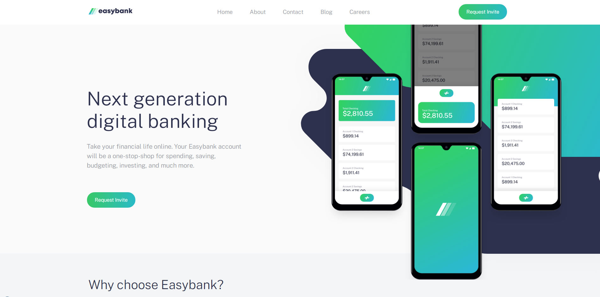

<h1 align="center"> Landing Page Easybank </h1>

    

## Descrição

Criação de uma Landing Page atrativa para os usuários contendo algumas animações para manter a atenção durante a navegação, Além de um menu hambúrguer para a versão mobile. O layout foi desenvolvido pela empresa **Frontend Mentor** que disponibilizou gratuitamente o designer com objetivo de teste pratico de habilidades. Na pasta DOC você encontra toda a documentação do projeto como layout e desafio proposto.

## Desafio proposto

os usuários devem ser capazes de:

* Visualize o layout ideal para o site, dependendo do tamanho da tela do dispositivo
* Veja estados de foco para todos os elementos interativos na página

## Construído com

* [HTML](https://www.w3schools.com/html/) - HTML abreviação para a expressão inglesa HyperText Markup Language, que significa: "Linguagem de Marcação de Hipertexto" é uma linguagem de marcação utilizada na construção de páginas na Web. Documentos HTML podem ser interpretados por navegadores. A tecnologia é fruto da junção entre os padrões HyTime e SGML.

* [CSS](https://www.w3schools.com/css/default.asp) - Cascading Style Sheets é um mecanismo para adicionar estilo a um documento web. O código CSS pode ser aplicado diretamente nas tags ou ficar contido dentro das tags "style". Também é possível, em vez de colocar a formatação dentro do documento, criar um link para um arquivo CSS que contém os estilos.

* [JavaScript](https://developer.mozilla.org/pt-BR/docs/Web/JavaScript) - CJavaScript é uma linguagem de programação interpretada estruturada, de script em alto nível com tipagem dinâmica fraca e multiparadigma. Juntamente com HTML e CSS, o JavaScript é uma das três principais tecnologias da World Wide Web.

* [SEO](https://www.quanzhanketang.com/website/web_search.html) - Otimização de Sites é o conjunto de estratégias com o objetivo de potencializar e melhorar o posicionamento de um site nas páginas de resultados naturais nos sites de busca gerando conversões, sejam elas, um lead, uma compra, um envio de formulário, agendamento de consulta e outros.

## Status do Projeto

**Concluido**: O projeto esta terminado, não havera futuras alterações de funcionalidade.

## Autor

* **Cesar dos Santos de Almeida** - *responsável pela construção e desenvolvimento do projeto*

## Licença
Este projeto está licenciado sob a licença MIT - consulte o arquivo  [LICENSE.md](LICENSE.md) para obter detalhes

## Links
* [Easybank landing page](https://www.frontendmentor.io/challenges/easybank-landing-page-WaUhkoDN) - link do desafio do Frontend Mentor.
* [Frontend Mentor](https://www.frontendmentor.io/) - Responsável por disponibilizar o desafio e os materiais como ilustrações e imagens para a criação do site

